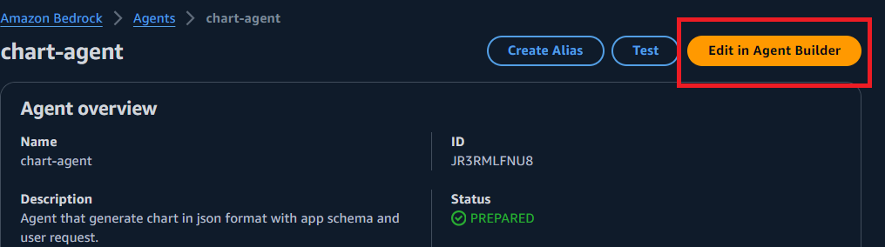
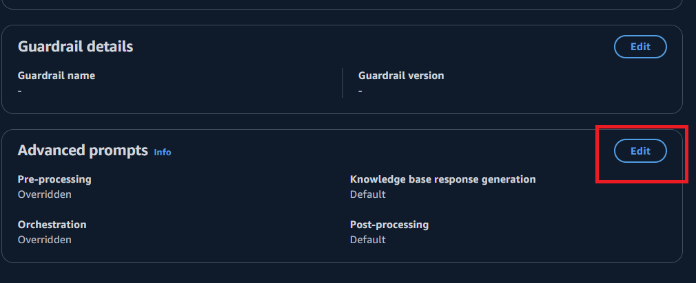
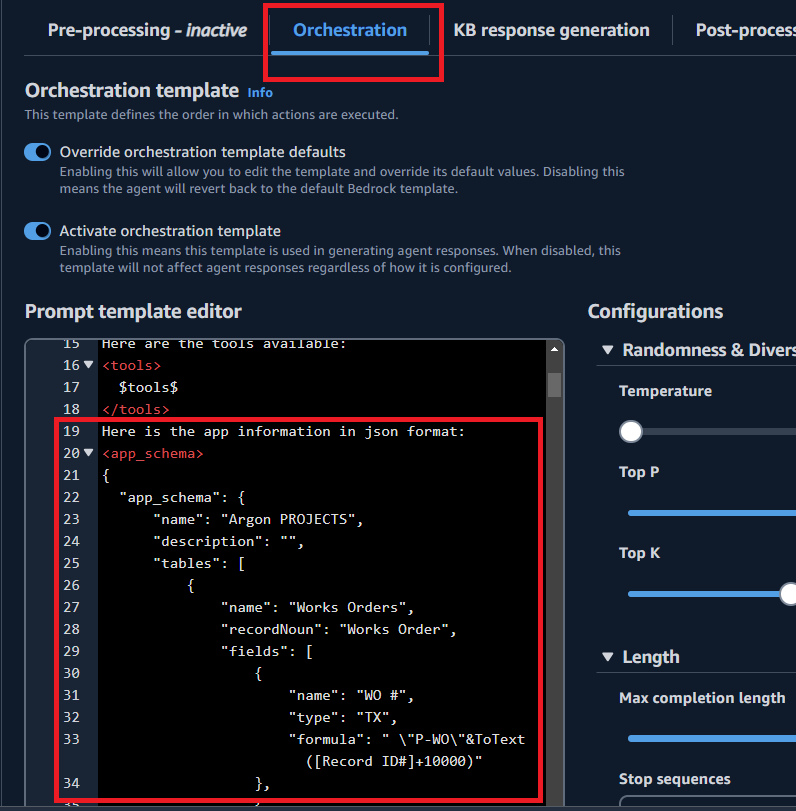
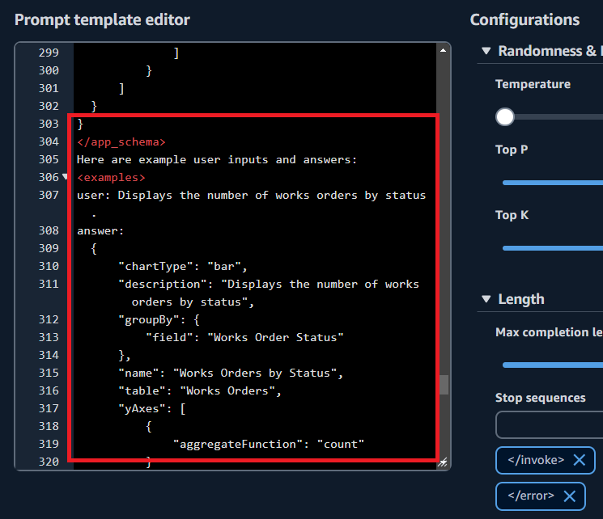
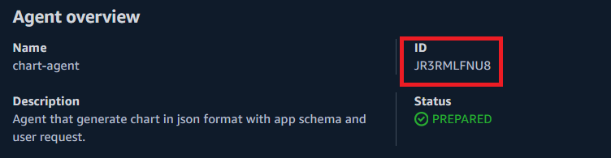
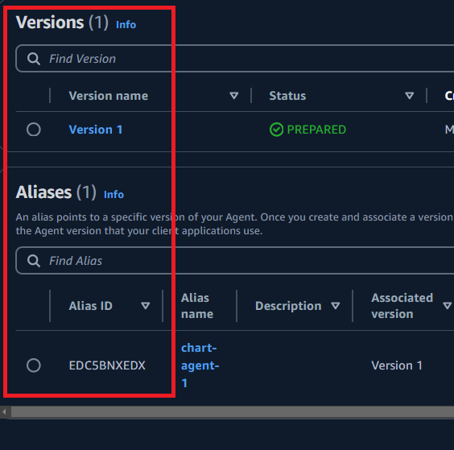

# Quickbase Chart and Query Generation

This project aims to create a tool that can generate custom charts and Quickbase queries based on user prompts. The tool utilizes the power of large language models, specifically LangChain and LangGraph, along with the OpenAI GPT-4o model, to understand user requests and generate the appropriate outputs.


## How to use

1. install python 3.10
2. `pip install -r requirements.txt`
3. `python langgraph-demo.py`
4. `python bedrock-agent-demo.py`
5. set `b_langgraph_agent = True` to see the results of langgraph


### User Input: 
`Displays the number of works orders assigned to each staff member`
### Quickbase Chart:

```json 
{
    "chartType": "bar",
    "description": "Displays the number of works orders assigned to each staff member",
    "groupBy": {
        "field": "Related Staff Member"
    },
    "name": "Works Orders by Staff Member",
    "table": "Works Orders",
    "yAxes": [
        {
            "aggregateFunction": "count"
        }
    ]
}
```
### User input: 
`6 Belongs to 'Tasks'`
### Quickbases Query: 
`query=({'6'.EX.'Tasks'})`

### Generation Node:
```json
{
    "chartType": "bar",
    "description": "Displays the number of works orders assigned to each staff member",
    "groupBy": {
        "field": "Related Staff Member"
    },
    "name": "Works Orders by Staff Member",
    "table": "Works Orders",
    "yAxes": [
        {
            "aggregateFunction": "count"
        }
    ]
}
```
### Reflection Node:
```
YES

The generated chart JSON information is correct. Here is the breakdown:

1. **chartType**: "bar" - This is appropriate for displaying counts.
2. **description**: "Displays the number of works orders assigned to each staff member" - This matches the user request.
3. **groupBy**: 
   - **field**: "Related Staff Member" - This is the correct field to group by to show the number of works orders assigned to each staff member.
4. **name**: "Works Orders by Staff Member" - This is a suitable name for the chart.
5. **table**: "Works Orders" - This is the correct table to use.
6. **yAxes**: 
   - **aggregateFunction**: "count" - This is the correct aggregate function to count the number of works orders.
```
## Features

1. **Prompt-based Chart Generation**: Users can provide natural language prompts, and the tool will generate the corresponding Quickbase chart configuration with app schema.
2. **Prompt-based Query Generation**: Users can provide natural language prompts describing the desired data query, and the tool will generate the corresponding Quickbase query.
3. **Role-based Prompting**: The tool can tailor its responses based on the user's role (e.g., analyst, manager, executive) to provide more relevant and tailored outputs.
4. **Few-shot Learning**: The tool can leverage a small number of example prompts and outputs to quickly adapt to new user requests, improving its performance over time.
5. **Knowledge Scaling**: When the underlying knowledge base becomes larger, the tool can utilize the Retrieval Augmented Generation (RAG) architecture to efficiently retrieve and integrate relevant information into the generated outputs.

## Tech Stack

- **Python 3.10**: The programming language used for the project.
- **LangChain**: A framework for building applications with large language models.
- **LangGraph**: A tool for integrating knowledge graphs into language models.
- **OpenAI GPT-4o**: A powerful large language model used for generating charts and queries.

## Bedrock Agent
- model : Claude 2.1
- Instruction for the Chart Agent :   
  ```You are a chart agent generating chart in json format based on app information. 
  You should learn from provided examples. What you should learn: 
  1. Output Schema.
  2. How to determine chartType from user request.
  3. How to determine table to answer user request. 
  4. How to determine field to group by.
  5. How to determine aggregate function. 
  Here's additional information: 
  1. chartType: bar, line, pie 
  2. aggregateFunction: sum, average, count. 
  Double check your work.
  ```
- Instruction for the Query Agent :
  ```
  You are a agent generating Quickbase query correponding to user request. 
  Please learn rules from provided examples. 
  Pleae make sure to follow the rules. 
  Double check your work. 
  ```
- click `Edit in Agent Builder` button

- scroll down, in advanced prompts section, `click Edit` button

- click `Ochestration` tab, add prompt (<app_schema>)

- add prompt (<example_schema>)

- agentID

- agentAliasID

## Contributing

Contributions to this project are welcome. If you have any ideas, bug fixes, or feature enhancements, please feel free to submit a pull request or open an issue.